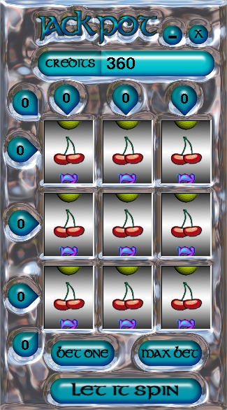



## Casino Slot Machine

### Description

Its a casino style slot machine, runs fine now, but there are still a few things I plan to add to it to make it better. You can place bets on 8 lines, with a total of 4 bets per line. Good GUI example, and commentted as well as I now how to. So maybe someone just starting can see how things work.
 
### More Info
 

             |
---                |---
**Submitted On**   |2005-02-16 16:18:18
**By**             |[Anthony Lohr](https://github.com/Planet-Source-Code/PSCIndex/blob/master/ByAuthor/anthony-lohr.md)
**Level**          |Beginner
**User Rating**    |4.3 (17 globes from 4 users)
**Compatibility**  |VB 6\.0
**Category**       |[Games](https://github.com/Planet-Source-Code/PSCIndex/blob/master/ByCategory/games__1-38.md)
**World**          |[Visual Basic](https://github.com/Planet-Source-Code/PSCIndex/blob/master/ByWorld/visual-basic.md)
**Archive File**   |[Casino\_Slo1853752162005\.zip](https://github.com/Planet-Source-Code/anthony-lohr-casino-slot-machine__1-58956/archive/master.zip)

